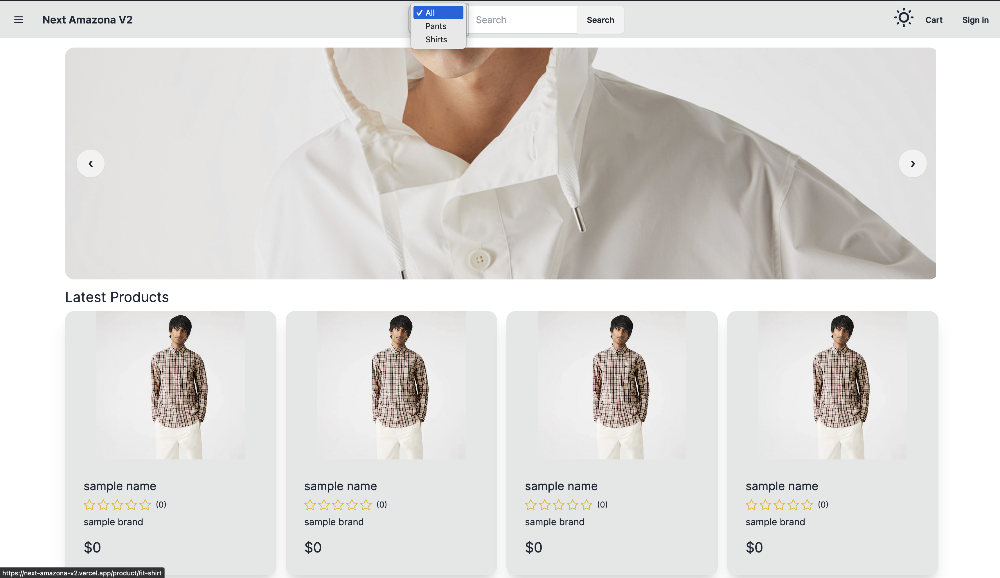

# Build Full-ECommerce By Next.js 13+, App Router, Server Components and Actions

1. Tech Nextjs 13+, Server Components & Actions, Route Handler
2. UI Tailwind, DaisyUI, Chart.js
3. Database MongoDB, Mongoose
4. Payment PayPal, Stripe
5. Deployment Github, Vercel, MongoDB Atlas
6. Authentication Auth.js, Google Auth
7. Others Cloudinary, Zustand, SWR

# 💻 Screen Shoot 💻

